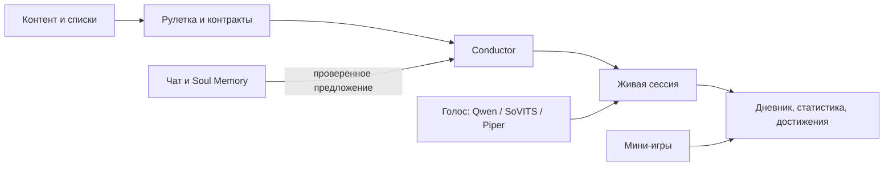

# JOI Conductor

**JOI Conductor** — локальное desktop-приложение 18+, которое собирает интерактивную сессию из ритма, инструкций, медиа, голоса персонажа и выбранных правил. Это не просто таймер: приложение ведёт сценарий, помнит контекст, предлагает действия и связывает сессии с прогрессом, контентом и мини-играми.

Проект ориентирован на Windows и запускается в отдельном окне через Electron. Основной интерфейс и данные русскоязычные.

> [!WARNING]
> Проект содержит материалы и механики только для совершеннолетних. Он рассчитан на добровольное личное использование и не является медицинским приложением.

## Что умеет приложение

### Собирать и проводить сессии

- **Рулетка** создаёт план из функций, BPM-паттернов, интенсивности, игрушек, медиа и вариантов финала.
- **Сессия** выполняет план по блокам: показывает текущую команду, ритм, таймер, медиа и доступные действия.
- План можно собрать автоматически, настроить вручную или дополнить во время прогона через лабораторию.
- Пресеты, ограничения и инвентарь фильтруют несовместимые варианты до запуска.
- Результат попадает в дневник, статистику, достижения и общую систему прогресса.

### Общаться с персонажем

- Свободный чат отделён от механического runtime сессии: модель пишет реплики, но не меняет BPM или состояние программы напрямую.
- **Soul Memory** хранит отношения, важные факты, темы, открытые линии и короткие итоги событий для каждой госпожи.
- Персонаж может предложить задание, изменение режима или новую сессию. Такие предложения проходят проверку и требуют явного принятия пользователем.
- Ответ появляется потоково; его можно остановить или повторить без дублирования сообщения.
- Доступны Ху Тао, Фурина, Искорка и Сунна со своими характерами, оформлением и голосовыми настройками.

### Работать локально или через облако

- **Приватно · Ollama** — основной разговор и память обрабатываются локальной моделью.
- **Обычный разговор · Groq** — быстрый облачный чат для повседневного общения; режим включается вручную возле поля ввода.
- При временной ошибке Groq приложение может продолжить ответ через доступную локальную модель и явно сообщает о переключении.
- Служебные роли Soul — разбор намерения, обновление памяти и планирование — остаются локальными и возвращают только проверяемые структурированные данные.

### Озвучивать ответы

- Шаблонный голос работает без LLM и остаётся безопасным резервом.
- **Qwen3-TTS** поддерживает локальный синтез, готовые голоса и режим клонирования по референсу.
- Для Qwen можно выбрать **Быстро · VRAM** или **Экономно · RAM** в зависимости от доступной видеопамяти.
- Также поддерживаются Piper и GPT-SoVITS.
- Экран «Голос и ИИ-ресурсы» устанавливает нужные runtime и веса, показывает состояние компонентов и позволяет проверить фактическую скорость синтеза.

### Подключать контент

- Раздел **Контент** объединяет локальные материалы, nhentai, booru-источники и JOIDB.
- Избранное, списки, фильтры и история используются не изолированно: выбранное медиа можно передать в рулетку, контракт или сессию.
- Для изображений доступен ручной цензор и опциональное локальное распознавание зон; видео и GIF можно закрывать целиком.

### Играть и развивать общий прогресс

- Встроены пазл, память, раннер, дудл и изометрическая ферма.
- Ферма — постоянный сохраняемый двор: культуры, ресурсы, постройки, животные, экономика и постепенные открытия вместо отдельных одноразовых уровней.
- Мини-игры связаны с выбранной госпожой, настройками стимуляции, достижениями и наградами приложения.
- Контракты формируют доску задач на день и могут использовать выбранный контент или подготовленный план сессии.

## Как это связано



`Conductor` остаётся владельцем правил и состояния сессии. LLM отвечает за речь и ограниченные предложения, но не может незаметно переписать план или прогресс.

## Приватность

JOI Conductor проектируется как **local-first** приложение. Настройки, память персонажей и история сохраняются на компьютере пользователя.

- В режиме Ollama текст разговора обрабатывается локально.
- В режиме Groq в облако отправляется только контекст текущего явно начатого облачного разговора и новая реплика. Локальный дневник Soul, приватная история и события сессий в этот контекст не добавляются.
- Облачный режим не определяет чувствительность текста автоматически: пользователь сам выбирает, когда его включать.
- Онлайн-каталоги контента и загрузка моделей, естественно, требуют сетевых запросов к соответствующим сервисам.

## Быстрый запуск

### Обычный способ на Windows

Запусти `Запуск.bat` из корня проекта. Скрипт подготовит приложение и откроет его в отдельном окне. Для остановки фоновых процессов есть `Остановить.bat`.

При первом старте приложение может предложить скачать нужные локальные среды и модели. Ollama, Groq, Qwen, GPT-SoVITS и нейросетевые инструменты остаются опциональными: базовые механики работают и без полного AI-набора.

### Запуск для разработки

Нужен актуальный Node.js LTS и npm.

```bash
npm install
npm run app
```

Полезные команды:

```bash
npm run dev       # только web-интерфейс на 127.0.0.1:5173
npm test          # тесты Vitest
npm run build     # TypeScript + production-сборка Vite
npm run soul-eval # оценка качества и маршрутизации Soul
```

Для полноценной проверки установщиков, локальных моделей, файловых диалогов и голоса нужен Electron-запуск через `npm run app`; браузерный dev-сервер покрывает только интерфейсную часть.

## Структура проекта

- `src/pages` — основные экраны: рулетка, сессия, чат, контент, прогресс и мини-игры.
- `src/lib` — правила Conductor, Soul Memory, контракты, прогресс и интеграционные контракты.
- `src/components` — общие UI-компоненты и панели настроек.
- `electron` — desktop-оболочка, локальные API, установщики и управление AI-процессами.
- `scripts` — запуск, диагностика, обработка ассетов и eval-сценарии.
- `data` — каталоги функций, паттернов, пресетов и характеров персонажей.
- `docs` — продуктовые и технические документы по отдельным системам.

## Ember

**Ember** — связанная top-down party JRPG с пошаговой стихийной боёвкой и воксельными зонами. Активная игра и создание нового контента развиваются в Godot 4 в отдельном проекте [`ember-godot`](https://github.com/YaR00i/ember-godot).

Оставшиеся в JOI Conductor Three.js-экран и редактор заморожены как legacy-оболочка и миграционный архив. Новые игровые механики и авторинг Ember здесь не развиваются.

## Документация

- [Оболочка, разделы и пользовательские потоки](docs/HUB.md)
- [План улучшений и состояние систем](docs/IMPROVEMENTS.md)
- [Архитектура первой версии Conductor](docs/V1_SPEC.md)
- [Голос и умные пресеты](docs/V2_SPEC.md)
- [Контент и додзинси](docs/DOUJIN.md)
- [Механика изометрической фермы](docs/NAUGHTY_FARM.md)
- [Игрушки и интеграции](docs/TOYS_MECHANICS.md)
- [Правила работы AI-агентов](AGENTS.md)

## Технологии

React 19, TypeScript, Vite, Electron, Vitest, Three.js и Phaser. Локальные AI-компоненты запускаются через Ollama и отдельные Python-runtime; облачный разговор поддерживает Groq через OpenAI-совместимый API.

Проект активно развивается: документация фиксирует текущие границы систем, а не обещание стабильного публичного релиза.
